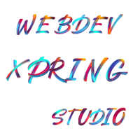

  

# 👋 Hello, I'm Harold - Full Stack Soccer Maestro ⚽

Welcome to my coding turf! I'm passionate about crafting seamless digital experiences through the perfect blend of chic design and backend precision. Every click is a play, and innovation is my game.

## 💼 Experience

As a seasoned Full Stack Developer, I've mastered the art of web tactics to create immersive user experiences. My expertise extends to:

- **Stylish Design:** I believe in the power of aesthetics to engage users and leave a lasting impression.
  
- **Backend Precision:** With a keen eye for detail, I ensure that every line of code contributes to a robust and responsive digital playground.

- **Innovation:** I thrive on fresh plays of innovation, keeping users cheering for more.

## 🚀 Key Projects

Here are some highlights from my portfolio:

- **Elegant Design Meets Robust Functionality:** Experience the perfect blend of aesthetics and technical precision, crafted to captivate and perform.
- **Seamless Digital Journeys:** From back-end efficiency to front-end delight, enjoy web experiences that are as smooth as they are engaging.
- **Innovation at its Best:** Explore projects that push the limits of web development, showcasing cutting-edge techniques and creative solutions.
- **Interactive Showcases:** Dive in and interact with these projects to see firsthand the skill and innovation behind each one.

## 📫 Let's Connect

Ready to collaborate or just want to chat about the beautiful game of soccer or web development? You can <!-- reach me at [your.email@example.com](mailto:your.email@example.com) or --> connect with me on [LinkedIn](https://www.linkedin.com/in/haroldzcaicedo/).

Keep coding, stay innovative, and score those digital goals! ⚽🏆
